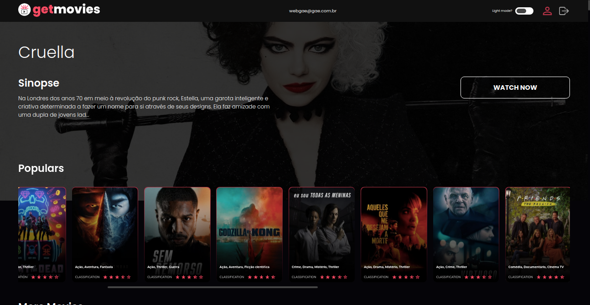

# getmovies

## Project

**_EN:_** As a practical challenge proposed by the technology company getmore, I developed this project which is basically an informative portal of the most recent and popular movies of today extracting real data from the movies through themoviedb API. Application built using the power of the nextjs tool where it is possible for the user to create their account and search for the desired movies.

**_PT-BR:_** Como um desafio prático proposto pela empresa de tecnologia getmore, desenvolvi este projeto que é basicamente um portal informativo dos mais novos e populares filmes da atualidade extraindo dados reais dos filmes através da themoviedb API. Aplicação construída utilizando o poder da ferramenta nextjs onde é possível ao usuário criar sua conta e procurar pelos filmes desejados.

This project was developed with the following technologies & libs:

- nextjs
- yup
- axios
- faunaDB
- nookies
- nprogress
- typescript
- react-icons
- @unform/web
- sweetalert2
- react-spinners
- styled-components
- jsonwebtoken & bcryptjs

## Preview Web



---

## Vercel Deploy

[getmovies in production](https://getmovies.vercel.app/)

---

### How To Install

To clone and run this application, you'll need Git, Node.js & NPM/Yarn or docker + docker-compose installed on your computer.

From your command line:

#### Install without docker

```bash
# Clone this repository
$ git clone https://github.com/gideonfernandes/frontend-challenge.git

# Go into the repository
$ cd frontend-challenge

# Install dependencies
$ npm i or yarn

# Start server
$ npm run dev or yarn dev

# running on port 3000
```

#### Install with docker & docker-compose

```bash
# Clone this repository
$ git clone https://github.com/gideonfernandes/frontend-challenge.git

# Go into the repository
$ cd frontend-challenge

# Build container
$ docker-compose build

# Start container app
$ docker-compose up

(use sudo if necessary)

# running on port 3000
```

### License

This project is under the MIT license.

---

# Challenge info - Desafio Frontend Getmore

Você foi selecionado para desenvolver um site que terá duas funções:

- Listagem dados;
- Mostrar detalhes;

## Recursos

Fique à vontade para escolher qualquer dados disponíveis publicamente em api na internet, aqui vão alguns exemplos:

- [The Movie DB](https://developers.themoviedb.org/3/getting-started/introduction)
- [Pokemon API](https://pokeapi.co/)
- [Spotify](https://developer.spotify.com/)

## Pré-requisitos

- A aplicação deve ser desenvolvida usando ReactJs
- O código do site deverá ser versionando no Github em repositório público;
- O README do repositório deverá conter instruções de como executar a aplicação localmente;

## Avaliação

- Uso de React moderno (componentes funcionais, react hooks, context API)
- Uso efetivo do git (commits concisos, títulos auto-explicativos, etc);
- Boas práticas de programação (clean code, uso de padrões, nomes de identificadores, tamanho de funções, perfomance);
- Organização do projeto;
- UX do site (layout agradável, leiturabilidade, usabilidade, etc);

## Bônus

- Fetching assíncrono usando hooks
- Quantidade de informações disponíveis na API escolhida
- Aplicação construida com [NextJs](https://nextjs.org/)
- Uso de componentes da lib [Material-Ui](https://material-ui.com/)
- Uso de [styled-components](https://styled-components.com/)
- Deploy em site de hospedagem (ex: Heroku)

## Como começo?

Aqui vão as etapas:

- Faça um fork desse repositório;
- Crie uma Pull Request com seu código pronto;
